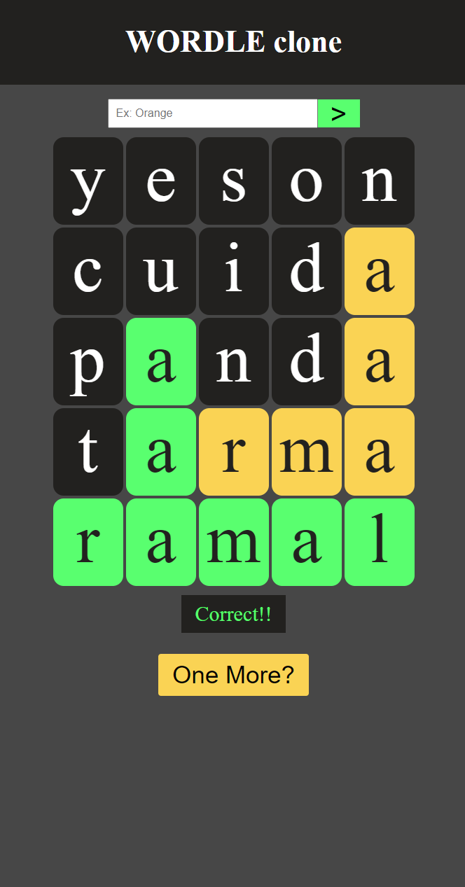

<h1>Wordle clone project</h1>

This is just a javascript project I've made to learn the basics of the language.

It consits basically on a minigame where you have to guees a random word by entering in an input box. The game will tell you wich letters are correct or belong to the original word.

Currently the database is in spanish 😅, pls if you find another database with more words in english let me know!!

A preview of the app:

